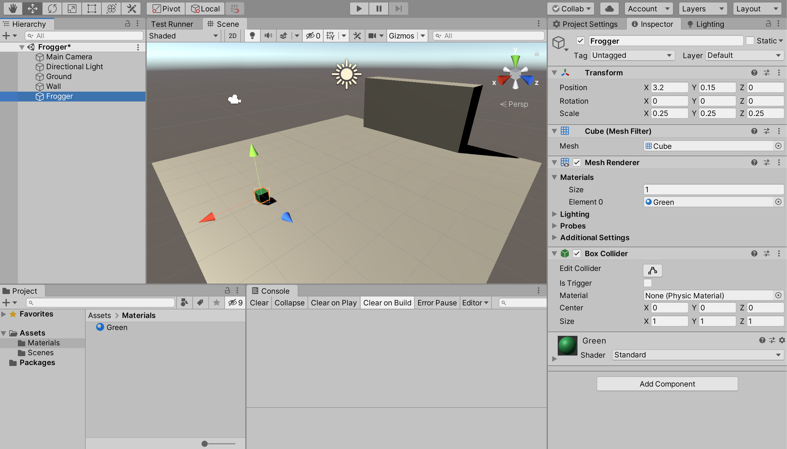
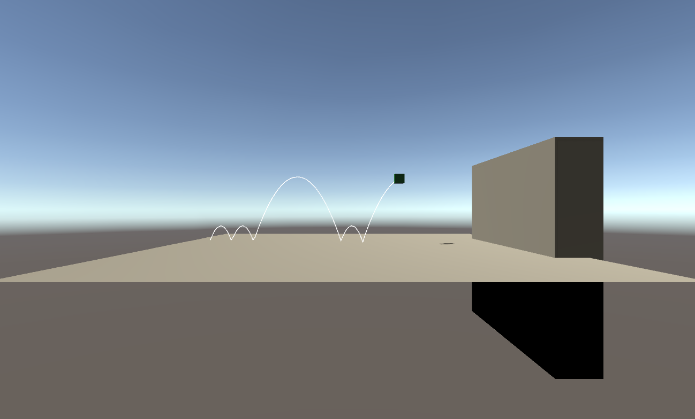
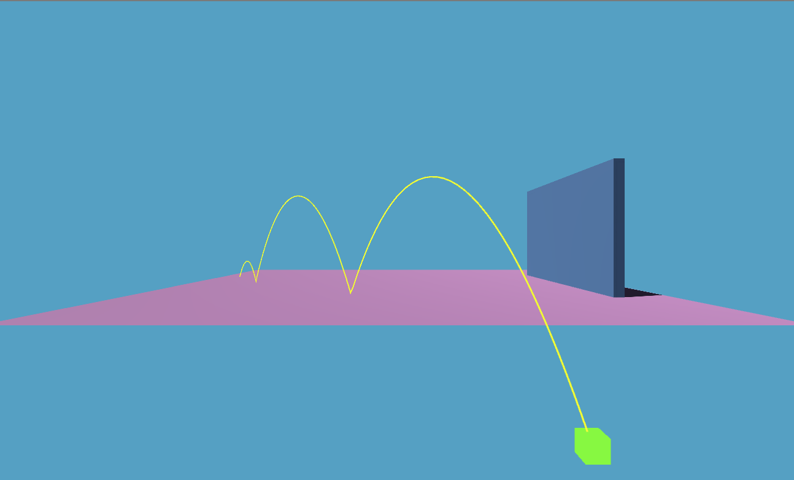

# Active-LT - Frogger tutorial

This is a simple tutorial to familiarize yourself with Behavior Trees and the Active-LT library. In this tutorial we are going to procedurally animate a simple "frog".

- The frog is jumping forward.
- Upon hitting a wall ahead, the frog has ended her journey and her task is *complete*.

## Setup

1. Create a Unity Project named 'Frogger'

2. Install Active-LT: open the Unity Package manager and use the [+] symbol to add the package using this URL:
`https://github.com/active-logic/active-lt.git`

3. Rename the sample scene to 'Frogger' and create 2 cubes and a plane, as depicted in the illustration.



## Jumping

Let's create a script named `Frogger.cs` -

```cs
using UnityEngine;
using Active.Core;
using static Active.Raw;

public class Frogger : MonoBehaviour{

    status state;

    void Update() => state = Jump();

    status Jump(){
        return done;
    }

}
```

Add the script to the 'Frogger' object (small green cube); play and verify nothing happens, no errors.

When working with behavior trees, we use *tasks*. A task may return `fail`, `cont` or `done`. In this case `Jump` is an empty task which completes immediately; so, we return `done`.

Modify the jump function:

```cs
status Jump(){
    var body  = GetComponent<Rigidbody>();
    var speed = body.velocity.magnitude;
    if(speed <= 1e-6f){
        body.AddForce(Vector3.up * 3, ForceMode.Impulse);
    }
    return cont;
}
```

Next, add a *Rigidbody* component to the Frogger object; press play and observe. You should see the frog leaping in place, without moving left or right.

Since we want the Frog to move forward we make the impulse vector configurable:

```cs
public class Frogger : MonoBehaviour{

    // Expose "impulse" variable
    public Vector3 impulse = new Vector3(1f, 3f, 0f);
    status state;

    void Update() => state = Jump();

    status Jump(){
        var body  = GetComponent<Rigidbody>();
        var speed = body.velocity.magnitude;
        if(speed <= 1e-6f){
            // Apply impulse here!
            body.AddForce(impulse, ForceMode.Impulse);
        }
        return cont;
    }

}
```

Upon playing, our frog is leaping forward until she hits the wall. This method is not precise (because of how physics interact with the update loop) so you get small and bigger jumps.



## Getting *done*

Our frog is now performing a simple task; however it does not know how to stop. Let's add collision detection to take care of this:

```cs
public class Frogger : MonoBehaviour{

    public Vector3 impulse = new Vector3(1f, 3f, 0f);
    status state;
    // Keep track of collision state (2)
    bool didCollide = false;

    void Update() => state = Jump();

    status Jump(){
        var body  = GetComponent<Rigidbody>();
        var speed = body.velocity.magnitude;
        if(speed <= 1e-6f){
            body.AddForce(impulse, ForceMode.Impulse);
        }
        // Return the `done` state on collide (3)
        return didCollide ? done : cont;
    }

    // Detect collision (1)
    void OnCollisionEnter(Collision x){
        if(x.collider.gameObject.name == "Wall"){
            didCollide = true;
        }
    }

}
```

Notice how Frogger does not directly respond to the collision. In our case the collision provides a stimulus, and we use control state (`didCollid`) to integrate with the status function.

We are now differentiating the *running* state (cont) from the *complete* state (done); however there is still no change to how the frog behaves. Let's fix that by changing the `Update` function:

```cs
void Update(){
    state = Jump();
    if(state.complete) enabled = false;
}
```

Press play and observe; once the frog has reached the wall, the behavior is disabled, and the frog stops jumping.

## Failing

We have created a simple task using the `cont` (running) and `done` statuses. Let's handle an obvious failure case: what if Frogger fall off the map? Modify the Jump task:

```cs
status Jump(){
    var body     = GetComponent<Rigidbody>();
    var speed    = body.velocity.magnitude;
    if(transform.position.y < -1f){
        body.isKinematic = true;
        body.velocity = Vector3.zero;
        return fail;
    }
    if(speed <= 1e-6f){
        body.AddForce(impulse, ForceMode.Impulse);
    }
    // Return the `done` state on collide (3)
    return didCollide ? done : cont;
}
```

Also change the `Update` function:

```cs
void Update(){
    state = Jump();
    if(!state.running) enabled = false;
}
```

To test this change 'impulse' to (1, 3, -1) in the Frogger inspector and press play; Frogger stops once the failure condition is fulfilled.



Here is the complete source for our sample behavior:

```cs
using UnityEngine;
using Active.Core;
using static Active.Raw;

public class Frogger : MonoBehaviour{

    public Vector3 impulse = new Vector3(1f, 3f, 0f);
    status state;
    bool didCollide = false;

    void Update(){
        state = Jump();
        if(!state.running) enabled = false;
    }

    status Jump(){
        var body     = GetComponent<Rigidbody>();
        var speed    = body.velocity.magnitude;
        if(transform.position.y < -1f){
            body.isKinematic = true;
            return fail;
        }
        if(speed <= 1e-6f){
            body.AddForce(impulse, ForceMode.Impulse);
        }
        // Return the `done` state on collide (3)
        return didCollide ? done : cont;
    }

    void OnCollisionEnter(Collision x){
        if(x.collider.gameObject.name == "Wall"){
            didCollide = true;
        }
    }

}
```

## What we learned

- In BT, tasks are running, complete or failing.
- With active logic (AL), tasks may be described using *status functions*.
- AL easily integrates with `MonoBehaviour`; while the library offers other choices for managing your BTs, stateless AL really can be used anywhere in your logic.

Although BTs are geared towards so called *sequences* and *selectors*, ***status* is the foundation**. Using statuses, you start thinking in terms of tasks having a complete/running/failing state.

Although Active Logic provides a correct, standard implementation of BT, it does not require creating a new class/object for every atomic task. A status function is a task.

## Coming next

In the next part we'll flex AL muscle and see how complex BTs are created by *composing* tasks. We will also do away with boiler plate by adopting `UGig`, which is a subclass of `MonoBehaviour`
