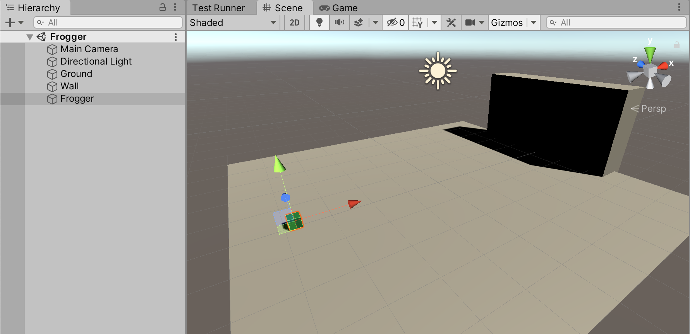
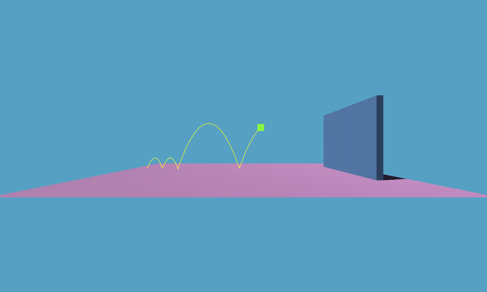

# Active-LT - Frogger tutorial

This is a simple tutorial to familiarize yourself with Behavior Trees and the Active-LT library. In this tutorial we are going to procedurally animate a simple "frog", as follows:
- The frog (in our case a simple cube) is jumping forward.
- Upon hitting a wall ahead, the frog has ended her journey and her task is 'complete'.

## Setup

1. Create a Unity Project named 'Frogger'

2. Install Active-LT: open the Unity Package manager and use the [+] symbol to add the package using this URL:
`https://github.com/active-logic/active-lt.git`

3. Rename the sample scene to 'Frogger' and create 2 cubes and a plane, as depicted in the illustration.



## Jumping

Next we create a script named `Frogger.cs` with the following content:

```cs
using UnityEngine;
using Active.Core;
using static Active.Raw;

public class Frogger : MonoBehaviour{

    status state;

    void Update() => state = Jump();

    status Jump(){
        return done;
    }

}
```

Add the script to the 'Frogger' object (the small green cube) then press play and verify that nothing happens and no errors are seen.

When working with behavior trees, we use *tasks*. A task may return `fail`, `cont` or `done`. In this case `Jump` is just an empty task, and it completes immediately. So, we return `done`.

We want to propel the frog whenever it is idle, so we change the jump function as follows:

```cs
status Jump(){
    var body  = GetComponent<Rigidbody>();
    var speed = body.velocity.magnitude;
    if(speed <= 1e-6f){
        body.AddForce(Vector3.up * 3, ForceMode.Impulse);
    }
    return cont;
}
```

Next, add a *Rigidbody* component to the Frogger object; press play.

Actually we'd like the Frog to move forward. So we'll make the impulse vector configurable:

```cs
public class Frogger : MonoBehaviour{

    // Expose "impulse" variable
    public Vector3 impulse = new Vector3(1f, 3f, 0f);
    status state;

    void Update() => state = Jump();

    status Jump(){
        var body  = GetComponent<Rigidbody>();
        var speed = body.velocity.magnitude;
        if(speed <= 1e-6f){
            // Apply impulse here!
            body.AddForce(impulse, ForceMode.Impulse);
        }
        return cont;
    }

}
```

Upon pressing play, our 'frog' is indeed jumping forward until they hit the wall. This method is not precise (because of how physics interact with the update loop), so you may get small or bigger jumps.



## Getting *done*

Our frog is now performing a simple task; however it does not know how to stop. Let's add collision detection to take care of this:

```cs
public class Frogger : MonoBehaviour{

    public Vector3 impulse = new Vector3(1f, 3f, 0f);
    status state;
    // Keep track of collision state (2)
    bool didCollide = false;

    void Update() => state = Jump();

    status Jump(){
        var body  = GetComponent<Rigidbody>();
        var speed = body.velocity.magnitude;
        if(speed <= 1e-6f){
            body.AddForce(impulse, ForceMode.Impulse);
        }
        // Return the `done` state on collide (3)
        return didCollide ? done : cont;
    }

    // Detect collision (1)
    void OnCollisionEnter(Collision x){
        if(x.collider.gameObject.name == "Wall"){
            didCollide = true;
        }
    }

}
```

At this stage we are differentiating the *running* state (cont) from the *complete* state (done); however there is still no change in how the frog behaves. Let's fix that by changing the `Update` function:

```cs
void Update(){
    state = Jump();
    if(state.complete) enabled = false;
}
```

Press play and observe; once the frog has reached the wall, the behavior is disabled, and the frog stop jumping.
