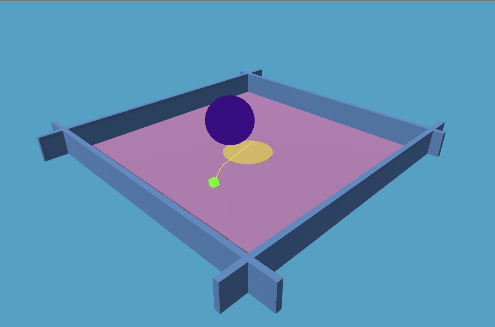

# Frogger tutorial P2 - Frog life

In the first part of this tutorial we created a simple 'frog' which implemented a simple *task*: hopping til she reaches a vertical wall.

In this second part let's evolve Frogger into acceptable wildlife.

## Maslow's hierachy of needs: a tribute?

A very acceptable structure for BT agents consists in prioritizing immediate threats/needs over light-hearted, wittier activities such as saving Peach. With Frogger, we consider the following activities:

- Avoid getting trampled (self-preservation)
- Eat aka avoid starving (self-preservation)
- Grow and multiply (long-term preservation!?)

Side goal implement the above within 100 lines of code?

## Good gig

Let's ditch `MonoBehaviour` - just keep in mind AL works with `MonoBehaviour` and it will also work with (the base class or interface provided by) your visual BT asset, if any (say, for implementing low level tasks).

Rename `Frogger.cs` to `FroggerZero.cs`. Next re-create a file named `Frogger.cs`.

```cs
// Frogger.cs
using UnityEngine;
using Active.Core;
using static Active.Raw;

public class Frogger : UGig{

    Rigidbody body;
    public float traction = 10;

    override public status Step(){
        body.AddForce(Vector3.right * traction);
        return cont;
    }

    void Start(){
        body = GetComponent<Rigidbody>();
    }

}
```

In your setup scene ensure Frogger uses the new 'Frogger' script; press play and confirm nothing happening, no errors.

`UGig` is a lightweight replacement for `MonoBehaviour`. It does not define any state, but also does nothing on its own. Add an `Agent` component and retest. Frogger is now rolling to the right.


## Top-down design

Now that we have a working setup we sketch our AI 'top down' starting with an empty implementation of each high level task.

```cs
public class Frogger : UGig{

    Rigidbody body;
    public float traction = 10;

    override public status Step(){
        return Dodge() || Feed() || Spawn();
    }

    status Dodge(){ print("✔ Dodge"); return done; }
    status Feed (){ print("𐄂 Feed");  return fail; }
    status Spawn(){ print("𐄂 Spawn"); return fail; }

    void Start(){
        body = GetComponent<Rigidbody>();
    }

}
```

`Step()` implements a selector, meaning that subtasks are listed in order of their decreasing priority. In BT this is also known as a *fallback strategy*

### Understanding selectors

Press play; console output indicates that `Dodge()` is called in a repeating sequence.

Now replace this:

```cs
status Dodge(){ print("✔ Dodge"); return done; }
```

With:

```cs
status Dodge(){ print("~ Dodge"); return cont; }
```

Again press play and observe that `Dodge` is printed in a repeating sequence. While the `Dodge` task has not completed it has not failed either, therefore the selector will not attempt successive tasks.

Finally replace `cont` with `fail`:

```cs
status Dodge(){ print("x Dodge"); return fail; }
```

In this case, we then observe that `Dodge`, `Feed` and `Spawn` are called in a repeating sequence. At every game frame the selector tries each task in succession. Finally `fail` is returned.

|||| ***A selector iterates, until the first succeeding task is found.***

NOTE: *Active logic provides its logging API - we will cover this in the next tutorial*

Now that we're done figuring selectors, we will simplify our skeletal implementation using C# 7 style syntax:

```cs
public class Frogger : UGig{

    // ...

    override public status Step()
    => return Dodge() || Feed() || Spawn();

    status Dodge() => fail;
    status Feed () => fail;
    status Spawn() => fail;

    // ...

}
```

When dealing with status functions the expression bodied syntax is advised for clarity and concision; this is not a requirement.

With that, sub-tasks may be implemented in any order. I'll start with `Feed`.

## A good snack

In the Unity Editor create a 'Food' tag.

Next here is our first (incomplete) implementation of `Feed`:

```cs
status Feed (){
    var food = GameObject.FindWithTag("Food");
    if(food) return cont;
    print("No food");
    return fail;
}
```

We now add an object to represent 'food' (I used a flattened cylinder named 'Crop'). Tag the object using the *Food* tag.


We want the Frog to get near the food. For simplicity I'll assume a renewable crop so 'eating' won't actually cause the crop to be depleted or destroyed. Let's update our implementation

```cs
status Feed (){
    var food = GameObject.FindWithTag("Food").transform;
    if(food){
        return Reach(food) && Consume(food);
    }else{
        return fail;
    }
}

status Reach(Transform obj)    => fail;
status Consume(Transform obj)  => fail;
```

As previously we continue refining top-down. Before proceeding, however, notice the `Reach(food) && Consume(food)` syntax. In AL the `A && B && ...` form specifies a *sequence*.

|||| ***A sequence iterates, until the first failing task is found.***

Given how sequences are defined, Frogger will move towards a crop or other food, until within feeding range. If Frogger is disturbed either while getting close, or while snacking on the delicious crop, she may later resume approaching the food source.

We now implement the `Reach` task:

```cs
status Reach(Transform target){
    var u = target.position - transform.position;
    var dist = u.magnitude;
    if(dist < 1f) return done;
    body.AddForce(u * traction);
    return cont;
}
```

Press play. Frogger quickly homes in on the food source. However this is not good enough! We prefer Frogger to hop so we'll just borrow a little from `FroggerZero`:

```cs
status Reach(Transform target){
    var u = target.position - transform.position;
    var dist = u.magnitude;
    if(dist < 1f) return done;
    if(body.velocity.magnitude <= 1e-6f){
        body.AddForce(u * 0.2f + Vector3.up * 2,
                      ForceMode.Impulse);
    }
    return cont;
}
```

And sure enough...


The crop won't get depleted but we still want to track Frogger's "hunger" state; for this we may add a "hunger" variable to `Frogger.cs`; eating reduces hunger.

```cs
public class Frogger : UGig{

    // ...

    public int hunger = 100;

    // ...

    status Consume(Transform obj){
        if(hunger <= 0 ) return done;
        hunger--;
        return cont;
    }

}
```

Testing, observe that, while near the crop, Frogger's hunger decrases until it reaches zero.

Our implementation of the feeding/metabolic process is not very neat. Hunger should increase over time (functional bug?). Also, adding variables to the controller is not good practice. Still, we are doing good! Let's push our luck.

## Nasty Ball of Dark

Every hero has an archenemy. Likewise Frogger is constantly threatened by a powerful, evil foe. Create a nasty ball of dark as illustrated. We also add "walls" around the game area (or the ball will fall off).


Promptly, create a `NastyBall.cs` script:

```cs
// NastyBall.cs
using UnityEngine;
using Active.Core;
using static Active.Raw;

public class NastyBall: UGig{

    public float traction = 20;

    override public status Step(){
        var u = Random.onUnitSphere; u.y *= 0.1f;
        GetComponent<Rigidbody>().AddForce(
                                  u * traction, ForceMode.Impulse);
        return cont;
    }

}
```

Attach a rigid body to the nasty ball. Also add the `Foe` and a `Ticker` component. Configure the ticker:

- *repeat rate: 5* (Run every 5 seconds)
- *first time: 1* (Wait 1 second on start)


Similar to agents, tickers drive the behavior tree. The difference is that a ticker fires at arbitrary intervals. Here we just use a ticker for convenience. More commonly, tickers let you run the logic at a lower frame rate (saves CPU cycles).

## A run for it

We will now implement the "dodge" task:

```cs
status Dodge(){
    var foe = GameObject.Find("NastyBall").transform;
    var u = transform.position - foe.position;
    var dist = u.magnitude;
    toFoe = dist;
    if(dist > 3f) return done;
    u.y = 0f;
    u.Normalize();
    body.AddForce(u * traction * 3f);
    return cont;
}
```

Intuitively `Dodge` should return *done* if we safely avoided the obstacle. However this is going to break our selector; consider this:

```cs
status Step() => Dodge() || Feed() || Spawn();
```

Clearly, if `Dodge` is done, the selector will short and later functions will not be called.

Resist the idea of returning an ad-hoc status from Dodge; this will only confuse things later on. Instead, flip the returned status:

```cs
status Step() => !Dodge() || Feed() || Spawn();
```

Press play.



## Grow and Multiply!

Let's implement the `Spawn` task:

```cs
public class Frogger : UGig{

    // Track Frog id no (for naming)
    static int id = 0;
    // Next Frogger clone
    public GameObject clone;
    // Max offsprings
    public int eggs = 1;

    status Spawn(){
        if(eggs == 0) return fail;
        clone.transform.position =
            transform.position + Vector3.right * 0.1f;
        clone.SetActive(true);
        if(--eggs > 1) clone = Clone(clone);
        return done;
    }

    void Start(){
        // Create first clone on start
        clone = Clone(gameObject);
        body = GetComponent<Rigidbody>();
    }

    GameObject Clone(GameObject original){
        clone = Instantiate(original);
        clone.name = $"Frogger #{++id}";
        clone.SetActive(false);
        return clone;
    }

}
```

This is the most complex task we have implemented so far so, let's detail how this works.

- Essentially, Frogger *replicates*. However replicating frogger upon calling spawn is *too late* as this would result in Lamarckian evolution. So, a first clone must be created on `Start`.
- We wish to allow multiple offsprings (`egg` count) however multiple clones on start would be inefficient; therefore, after activating the current clone (assuming eggs left) we re-clone it right away.

Aside.

`Feed` is lacking a condition: if hunger is zero, it should return "done". We want `Spawn` to trigger when frogger is *not* hungry; again let's update the `Step()` function:

```cs
override public status Step()
=> !Dodge() || !Feed() || Spawn();
```

At this point we might as well switch 'Step' to a sequence:

```cs
override public status Step()
=> Dodge() && Feed() && Spawn();
```

Press play and observe.


## What we learned

With `UGig` the `Step()` function is automatically invoked by either an `Agent` or `Ticker`. An *agent* runs the BT at every frame while a *ticker* runs at regular intervals. Use tickers primarily for optimization (reduces CPU load).

*Sequences* and *selectors* (collectively: composites) help us combine simple tasks to create ever more complex agents. In Active Logic, sequences and selectors are implemented using the conditional logical operators `&&` and `||`.

When designing tasks, ensure the returned status makes intuitive sense. Use `!` and [other unary operators](https://github.com/active-logic/activelogic-cs/blob/master/Doc/Reference/Status.md) to tweak statuses.

## Coming next

While our implementation is *relatively* concise (78 loc) mixing state and control is not very good. In the next session we clean our act and refactor `Frogger` for performance and modularity.
