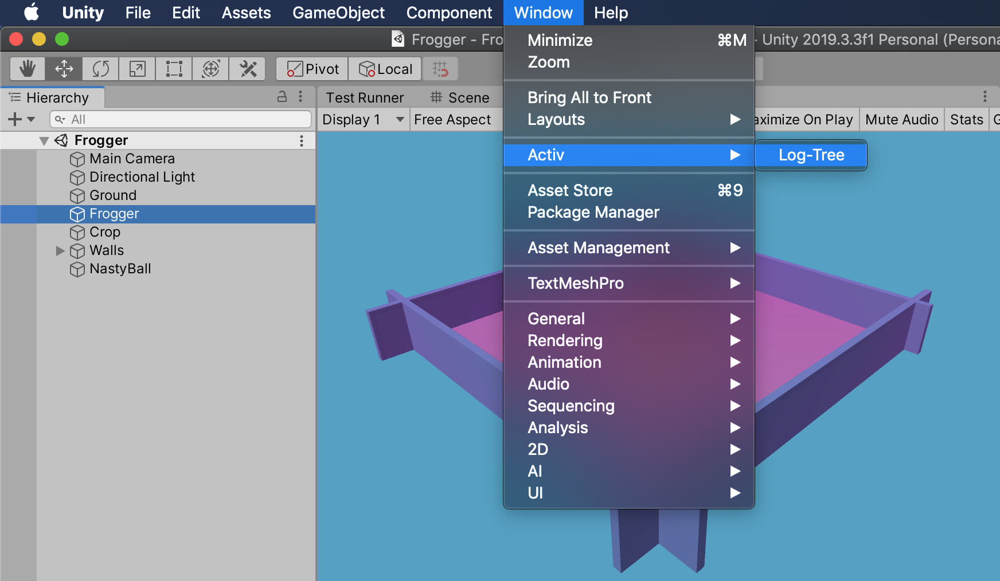
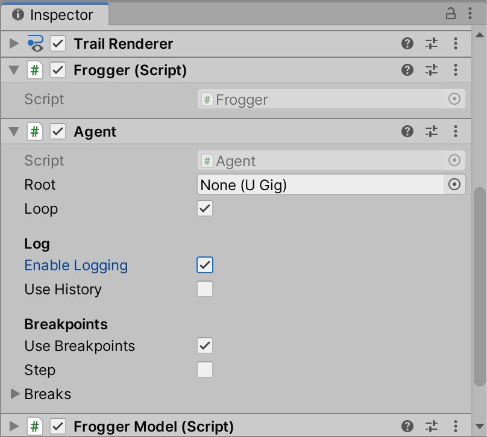
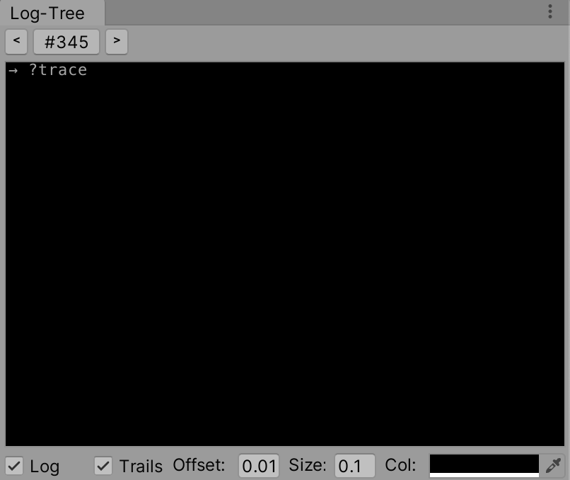
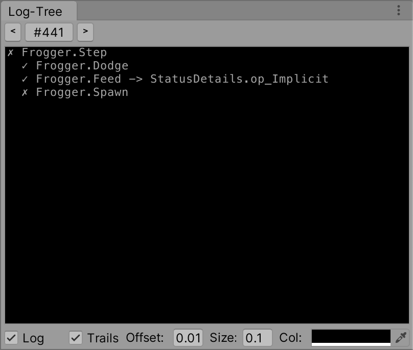

# Frogger tutorial P4 - Logging

In the fourth and final part of this tutorial, we are looking at logging and visual facilities in Active Logic.

## When is logging important?

You may use AL with a debugger. Compared with other libraries this works well because your program structure is straightforward.
This means that debugging AL programs is no harder than with regular update loops.

However, in many ways conventional debuggers are not helpful when dealing with update loops. Visual BT solutions do better; so does AL.

The logging API is especially helpful to diagnose high level behaviors. As an example, an advanced AI may be headed in a certain direction. This does not tell you *why* they are doing that.

## The logtree view

Enable the log-tree view via *Window > Activ > Log-Tre*.



Next, dock the log-tree view, select Frogger and check *enable logging* in the `Agent` inspector.



Press *Play*; initially the log-tree view only displays the `?trace` message; at this stage, this is normal.



## Introducing the logging API

The logging API uses concise annotations. In this section, the process of annotating sources is explained.

Commonly, you annotate sources while developing; in this case, however, we will quickly convert the `Frogger` AI to use these annotations.

### 1. Using Active.Status

In *Frogger.cs*, replace `using static.Active.Raw` with `using static.Active.Status`.

### 2. Replace status constants

Replace every instance of `done`, `cont`, `fail` with `done()`, `cont()`, `fail()`

NOTE: *The `Raw` scope is new in AL 1.3; a later version of AL may allow logging constants without `()`*.

### 3. Wrap expressions using `Eval(..)`

As an example of using `Eval`, we will annotate the `Dodge` function:

```cs
status Dodge() => Eval(
    (ap.dodgeVector == Vector3.zero) ? done() :
   -model.Propel(ap.dodgeVector * 3f)
);
```

Next, consider the `Spawn` function. Here the situation is less obvious:

```cs
status Spawn(){
    var clone = model.Clone();
    if(!clone) return fail();
    clone.position = transform.position + Vector3.right * 0.1f;
    return done();
}
```

It turns out, however, that there is no need to use `Eval(..)` here. This is because each `return` statement already uses an annotated status keyword.

In summary:

- Whenever returning a status expression, wrap the expression with `Eval(..)`.
- If you are only returning a status constant, the postfix `()` suffices and there is no need to use `Eval()`.

Now press *Play* and observe; you will be seeing output looking like:



According to the above output, `Dodge` and `Feed` are succeeding, suggesting that the Nasty Ball is not in range, and Frogger is not hungry.

`Spawn` is failing because Frogger has already spawned an offspring; since Spawn is failing, the `Step` function is also failing.

## Other logging features

In addition to visual logging, Active-LT and Active Logic also support visual history and soft breakpoints. Please refer to the [Unity integration guide](https://github.com/active-logic/activelogic-cs/blob/master/Doc/Reference/Overview.md) for information about these features.

## Logging and visual history without the logging API

If you do not want to use the logging API, the [Prolog package](https://github.com/active-logic/prolog) (free) offers similar functionality. Prolog instruments your assemblies on the fly. It is a standalone debugging tool, and as such does not specifically target BTs.

Logging automation may be added to AL at a later date. If you are looking forward to this feature, [upvote issue #62](https://github.com/active-logic/activelogic-cs/issues/62) <!-- and consider offering a sponsorship. -->

## Bonus stage: Worship the Stone

[Pending a complete investigation of the Utah Monolith](https://www.theguardian.com/us-news/2020/nov/24/monolith-utah-theories-what-is-it-mystery).

<!--


Thus far Frogger's only concern has been survival. A happy frog will engage in other activities, such as expressing gratitude to the gods and weather.

Let's add a monolith to the scene. This will be our god.

[IMAGE]

Next, we will update the `Step()` function:

```cs
override public status Step() => Eval(
    Dodge() && Feed() && Spawn() && Worship()
);
```

Here is our implementation of the 'Worship' function.

```cs
status Worship(){
    var u = Dir("Monolith");
    var dist = ...;
    if(model.IsIdle){
        return Reach( Dist("Monolith") < 5f
                      ? BackPosition : FrontPosition )["To position"];
    }else
        return cont[];
}
```
-->
